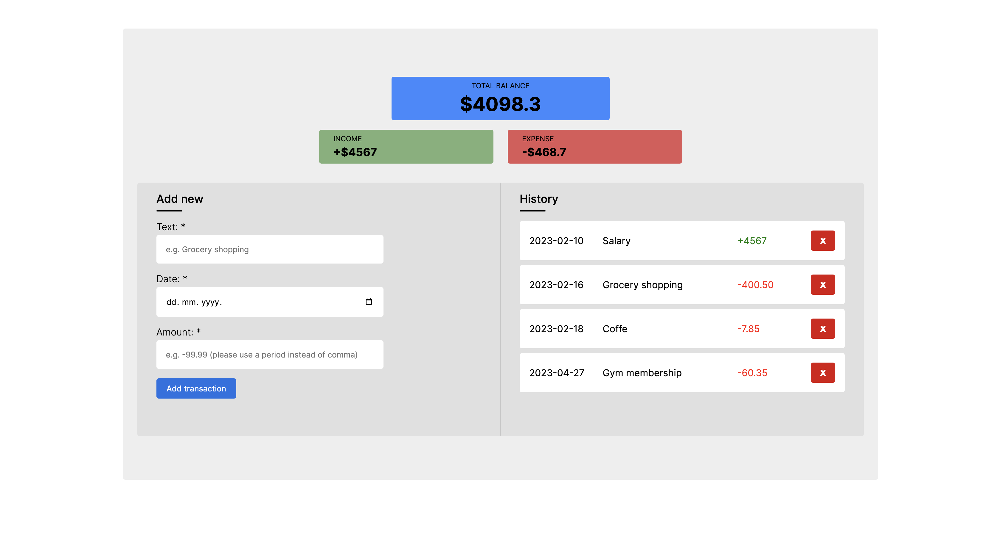

# Expense Tracker App

This is a simple expense tracker app built with HTML, CSS, and JavaScript. It allows you to add your incomes and expenses, and see them as well as your total balance. 
 
Once you have the app open, you can start adding your incomes and expenses by filling out the form on the right side of the screen. You will need to enter a description, date, and amount for each transaction.
 
You can see your total balance at the top of the screen, as well as a list of all your transactions. The list includes the date, description and amount.
 
You can also delete a transaction by clicking on the "Delete" button next to the transaction in the list. Note that this feature is not yet fully implemented and may not work as expected.

